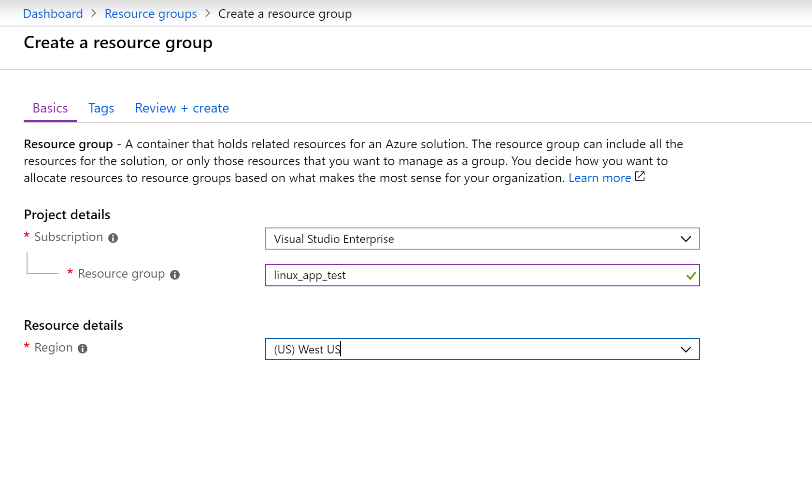
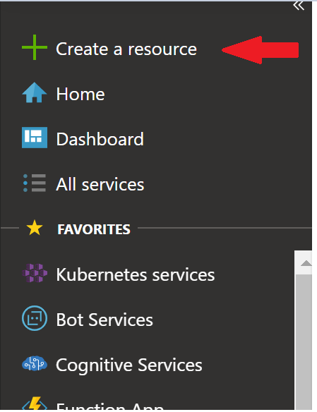
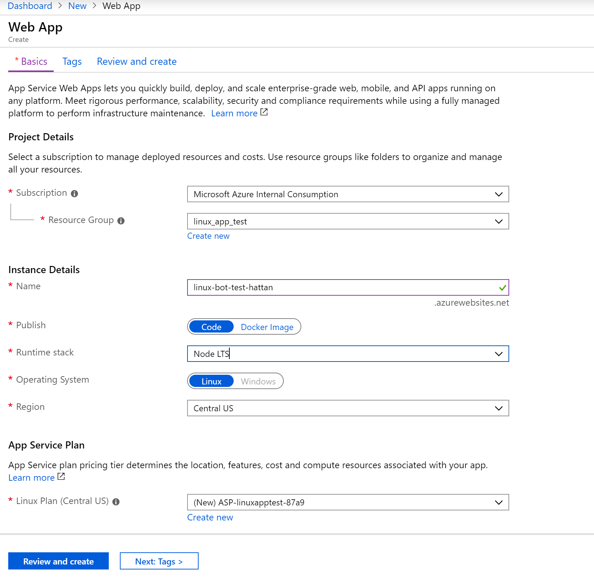
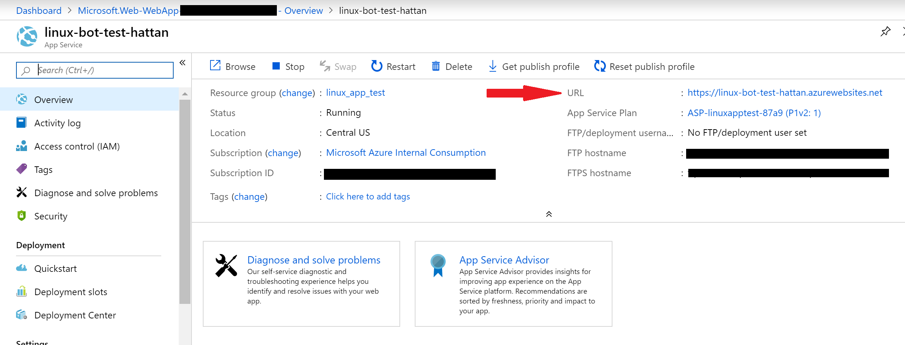
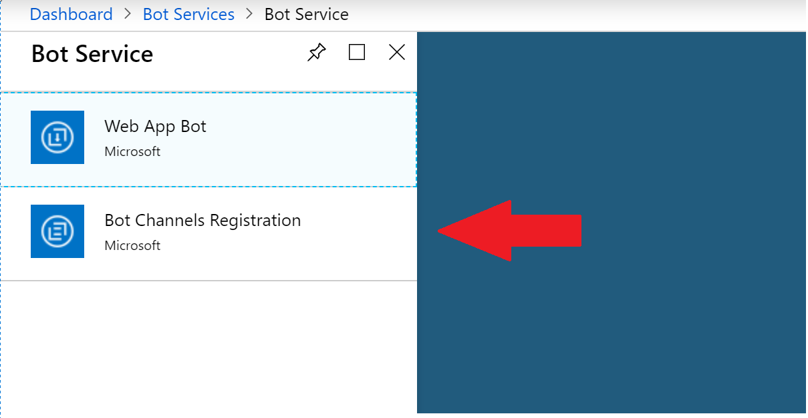
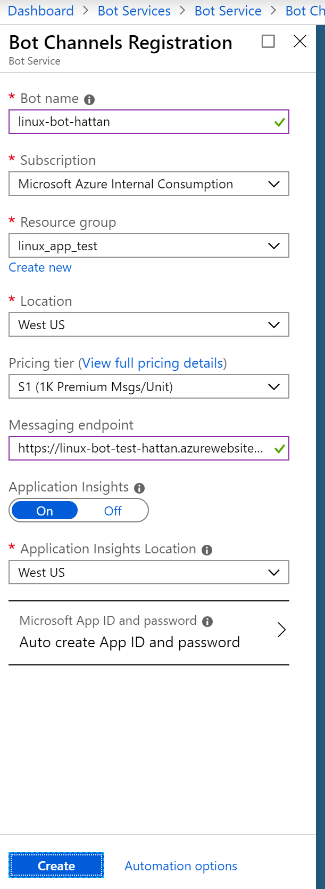
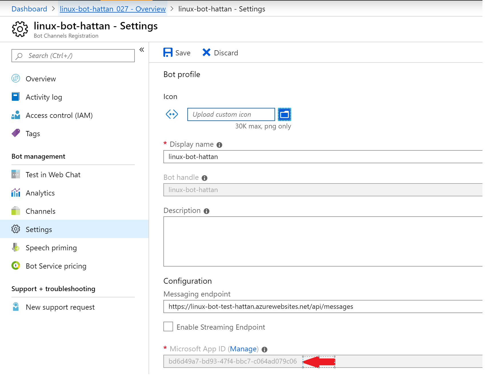
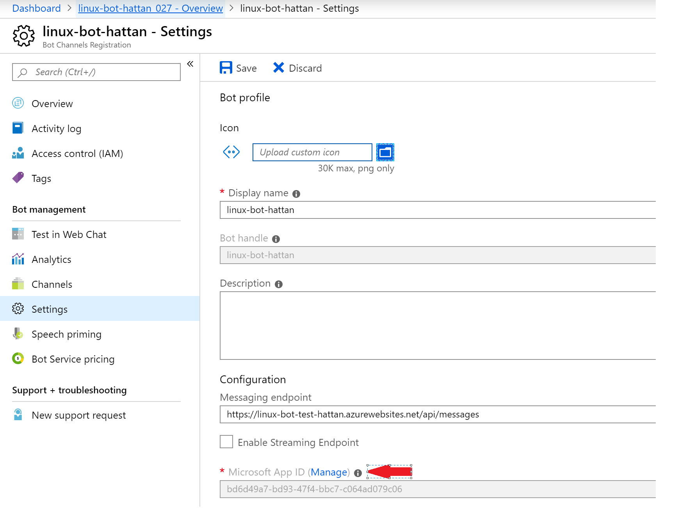
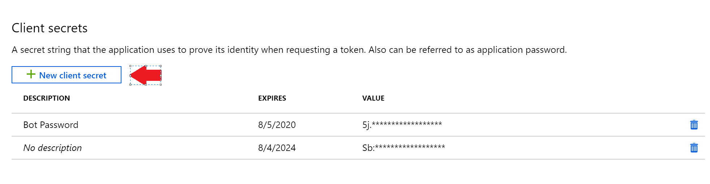

# Create a Bot Service running on a a Linux App Service - Azure Portal Walkthrough

## Create Resource Group

* On the Azure Portal, nagivate to Resource Groups and create a new resource group
* Name the new resource group linux_app_test

* Click Review and Create, then Create. 
* Click "Review and Create" then "Create" once validation passes.

## Create Linux App Service

* Click on "Create a resource." (top right) 

* Create a new "Web App"
* Select the linux_app_test resource group we created earlier.
* Enter a name for your app service
* Ensure Linux is selected
* For Runtime stack select Node LTS

* Select Create & Review, then create.

Once the deployment is complete and the app service has launched, we need to grab the url of the app service.

* Navigate to the overview page for the app service you just created and take note of the URL.

### Deploy your code 
The easiest way to deploy your code is using git. An Azure App Service can be configured to be a git remote. 

### Create Bot Service

* Login to the Azure Portals and create a new Bot Service. 
* Select the Channel Registrations Bot option.

* Fill in the options
* Under endpoint, enter the url of your app service  followed by /api/messages. (Note it must be an https endpoint)

### Create MS AppId and Password

After launching, go to Settings
Grab the App Id

Click Manage

Add a new Client Secret

Note the newly created secret.

### Configure environment variables on App Service
Go back to your app service
Go to configuration
Enter three new Application Settings
  * MicrosoftAppId = {{ App Id }}
  * MicrosoftAppPassword =  {{ Client Secret }}
  * RunningEnvironment = "linux App Service"

<screen shot App settings>

Click save

### Test Bot
Go back to to your bot service
go to Test in WebChat
Enter a message for your bot, you should see a response!

<screen shot Bot Running in Azure>

### Summary
In this walkthrough , you were introduced to running a bot on a Linux App Service.